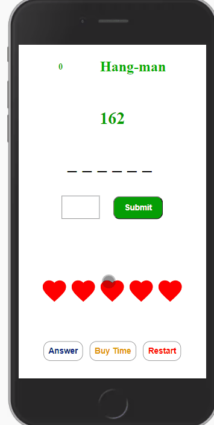
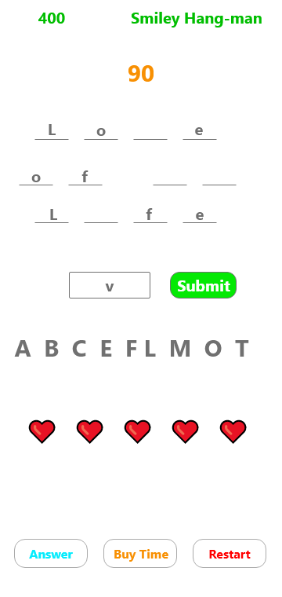

# Hang-man

### Table of Contents

1. Purpose
2. Motivation
3. Link to play game
3. Wireframe
4. How to play
5. Technologies Used

### Purpose:

Kids web game based on the old hang man game

### Motivation:

The goal was to practice building apps in shorter time periods with Angular

### Play the game
Click to play the game: [Hang Man](https://smiley-hangman.netlify.app/)

### WireFrame

### How to play:

- User will choose a letter and push the submit button
- If the letter is in the random selected word, then the user will get points.
- Regardless if the letter is in the selected word or not, the letter is displayed as a previous chosen letter
- User has 3 minutes to answer all word challenges. 
- User can buy more time with their points.
- If the user choose an incorrect letter, they lose 1 of their 5 starting lives. 
- If user guess all the letters, then they get another life and an extra 100 points. 

### This app was built with the following technologies:

**Angular 11:** JavaScript front-end library for building user interfaces

**Git-Hub:** Web-based version control repository and Internet hosting service

**Abode XD** A wire-framing tool used to create a mockup/visual of what is to be coded

**JavaScript:** Object-oriented programming language for web pages

**HTML:** Mark-up language for creating web pages

**CSS:** A formatting language for styling web pages

_Created by JC Smiley in December of 2020_
